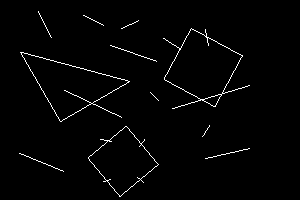

# shape_finder

Find shapes in the image

## Grabbing the code
```
git clone https://github.com/...
```

## Setup requirements
Install all requirements:
```
pip install -r requirements.txt
```

## Running application
```
python shape_finder.py -s shapes_file_name -i image_name
```
where

* `shapes_file_name` - shapes file name, e.g. `input.txt`
* `image_name` - image name, e.g. `image.png`

### Input

#### Shapes file

Shapes file should contain:

* number `N` - shapes number
* `N` lines with coordinates `X`, `Y` of shapes vertexes

E.g.:

```
2
0, 0, 1, 1, 1, 0
0, 0, 0, 1, 1, 1, 1, 0
```

#### Image



### Output

Output contains:

* number `M` - number of detected primitives
* `M` lines with transformations: shape number, bias `X`, bias `Y`, scale and rotation angle

E.g.:

```
3
1, 119.42248489811963, 195.5178847138241, 49.70915408654627, 230.79279649503218
0, 128.21544389656117, 81.87643658873696, 78.63841300535, 150.16446089973843
1, 163.32657210388606, 78.40517223935042, 57.50217387195027, -61.23235066115621
```
